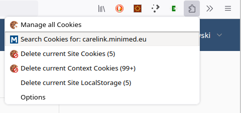

# Carelink Python Client
*Experimental Medtronic CareLink Client in Python*

Python library, which can be used for retrieving data from Medtronic CareLink of online CGM and insulin pump device data uploads (Guardian Connect, MiniMed 7xxG) inside and outside of US. 

This is a port of the Java library [CareLinkJavaClient]( https://github.com/benceszasz/CareLinkJavaClient)


## Status

This is a developer version. Works for me. Extensive testing of different use cases is needed. Please report back if it works also or you.


## Supported devices

- [Medtronic Guardian Connect CGM](https://hcp.medtronic-diabetes.com.au/guardian-connect) (*to be confirmed*)

- [Medtronic MiniMed 770G pump](https://www.medtronicdiabetes.com/products/minimed-770g-insulin-pump-system) (*to be confirmed*)

- [Medtronic MiniMed 780G pump](https://www.medtronic-diabetes.co.uk/insulin-pump-therapy/minimed-780g-system)

  

## Features

- ~~Login to CareLink and provide access token for CareLink API calls~~
- Needs initial valid access token obtained by manual login to Carelink follower account
- Refresh the access token before it expires
- Some basic CareLink APIs: get user data, get user profile, get  country settings, get last 24 hours, get recent data from CareLink Cloud
- Wrapper method for getting data uploaded by Medtronic BLE devices of the last 24 hours
- CareLink Client CLI
- CareLink Client Proxy


## Limitations

- CareLink MFA is not supported
- Notification messages are in English


## Requirements

- CareLink account (with MFA NOT ENABLED)

  - Guardian Connect CGM outside US: patient or care partner account
  - Guardian Connect CGM inside US: **not tested yet!** (possibly a care partner account)
  - 7xxG pump outside US: care partner account (same as for Medtronic CareLink Connect app)
  - 7xxG pump inside US: care partner account (same as for Medtronic CareLink Connect app)

- Runtime: Python3

- External libraries used:

  - Python Requests


## How to use

### Clone this repository

```
git clone https://github.com/ondrej1024/carelink-python-client.git
cd carelink-python-client
```

### Get data of last 24 hours

#### Carelink Client library

`carelink_client.py` is a Python module that can be used in your own Python application.

    import carelink_client
    
    client = carelink_client.CareLinkClient("access_token", "carelink_country_code")
    if client.login():
        recentData = client.getRecentData()

#### Carelink Client CLI

`carelink_client_cli.py` is an example Python application which uses the `carelink_client` library to download the patients Carelink data via command line.

    python carelink_client_cli.py -t cookies.json -d

##### Get CLI options

    python carelink_client_cli.py -h

#### Carelink Client Proxy

`carelink_client_proxy.py` is a Python application which uses the `carelink_client` library. It runs as a service and downloads the patients Carelink data periodically and provide it via a simple REST API to clients in the local network.

    python carelink_client_proxy.py -t cookies.json -d

##### Get CLI options

    python carelink_client_proxy.py -h

### Token file

In order to authenticate to the Carelink server, the Carelink client needs a valid access token. This can be obtained by manually logging into a Carelink follower account via Carelink web page. After successful login, the access token (plus country code) can be saved to a file using the [Cookie Quick Manager](https://addons.mozilla.org/en-US/firefox/addon/cookie-quick-manager/) Firefox plugin as follows: 

- With the Carelink web page still active, open Cookie Quick Manger from the extensions menu
- Select option "Search Cookies: carelink.minimed.eu"




- From the new page select "Save domain to file" from the "Export/Import" icon


- This will save a file called `cookies.json` to your download folder. Use this file with the `-t` option of the example programs
- Now you should close the Carlink login page to avoid automatic logout after some time

It is recommend to use a dedicated Carelink follower account  for this to avoid invalidating a token which Carelink client is using  when logging into the Carelink account from the web page.


## Credits

This project is based on other peoples work which I want to thank for their efforts.

* [Bence Szász](https://github.com/benceszasz) for the original  Java implementation
* [Ben West](https://github.com/bewest) for providing valuable details on the Carelink API and workflow


## Disclaimer

This project is intended for educational and informational purposes only. It relies on a series of fragile components and assumptions, any of which may break at any time. It is not FDA approved and should not be used to make medical decisions. It is neither affiliated with nor endorsed by Medtronic, and may violate their Terms of Service. Use of this code is without warranty or formal support of any kind.
